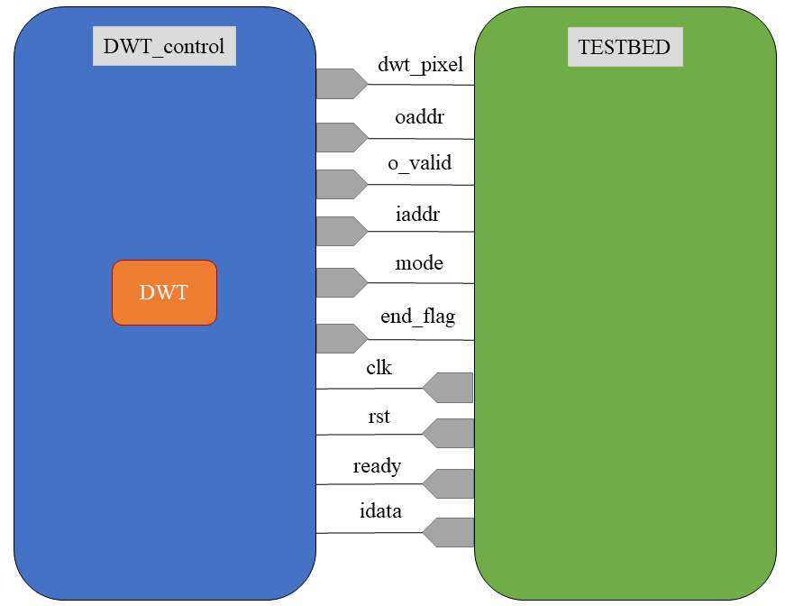
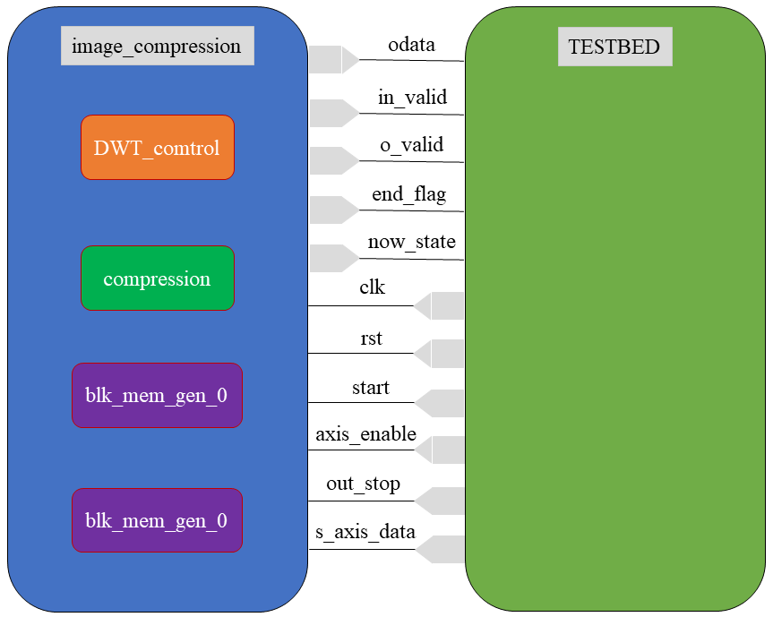

# **Final Project**  
Topic: KT Gray Image Compression Encoder  
  
Copyright @ K.T. Tu  
  
&emsp;&emsp;The content is for reference and discussion purposes only. Please refrain from copying, plagiarizing, or engaging in any activity related to exchanging benefits.  
&emsp;&emsp;If you have any questions, please feel free to contact me at my email address: ting6452@gmail.com  
  
## Introduction  
&emsp;&emsp;KT Gray Image Compression Architecture combines the specifications of both JPEG and JPEG2000 image compression. This method not only avoids some drawbacks of JPEG, such as mosaic distortion, but also retains several advantages of JPEG2000, such as real-time decoding. Compared to JPEG2000, it boasts lower computational complexity, and is also much more suitable for hardware implementation.  
&emsp;&emsp;In this project, we utilized Zedboard for the hardware implementation of the encoder and then developed the decoder using MATLAB.  
  
## Principle  
### 1. DWT Filter

  

  

&emsp;&emsp;The image is passed through a low-pass filter (Eq1) and a high-pass filter (Eq2) respectively, and then down-sampled to compress the image data.  

  

&emsp;&emsp;The processing of utilizing symmetric extension at the image edges is performed. Due to the utilization of only the data from the image boundaries during the extension, it does not significantly increase the amount of data. Moreover, since the extended image becomes continuous at the image edges, this method is advantageous for reducing boundary effects.  
### 2. Dead-Zone Scalar Quantization  

  

&emsp;&emsp;In this operation, we will quantize the data by discarding some bits to achieve data compression.  
### 3. Difference Operation  

  

&emsp;&emsp;In this operation, we first divide the data processed in the previous steps into four regions: LL, HH, LH, and HL. Then, for each region, we subtract each column of data from its left column and record the difference. This step aims to concentrate the frequency of data occurrence.  
### 4. Data Compression  

  

  

&emsp;&emsp;In this operation, we first divide the data of each pixel into groups of 4 bits and apply Huffman coding to each group individually. As a result, the number of data after this layer will be M times the original. However, due to Huffman coding, the total number of output bits will be fewer than the input.  
&emsp;&emsp;The pre-analysis reveals that the frequencies of data occurrences are mostly the same, so we predefine the format of Huffman coding to reduce complexity and speed up the computational speed of the architecture.  
## Architecture  
### 1. System  

  

&emsp;&emsp;a.&emsp;Hardware design, which includes DWT, quantization, difference calculation, and Huffman coding.  
&emsp;&emsp;b.&emsp;Communication protocol, which involves AXI4-Stream and AXI4-Lite.  
&emsp;&emsp;c.&emsp;Software design, which includes reading/writing data from an SD card.  
### 2. Encoder Architecture  

  

  

### 3. RTL Design Module  

  

  

## Module Interface Description  
### 1. Hardware Core   

  

  

- DWT Module Inputs/Outputs Signals
  
| Signal Name | I/O | Width |  Simple Description |  
|    :----:   | :----: | :----: |      :----      |  
|dwt_pixel    |O|10|輸出經過DWT運算後的值 |  
|h_or_g       |O| 1|表明輸出的值是經過哪種filter，經過h filter則輸出0，經過g filter則輸出1|  
|clk          |I| 1|系統時脈訊號，本系統為同步於時脈正緣之同步設計|  
|rst          |I| 1|低位準”非”同步(active low asynchronous)之系統重置信號|  
|ready        |I| 1|高位準表明輸入的值為有效的|  
|idata        |I|10|輸入灰階圖像像素資料訊號，MSB為資料的signed bit|  
|sp           |I| 4|表明當前硬體的工作時序|  
- DWT_control Module Inputs/Outputs Signals
  
| Signal Name | I/O | Width |  Simple Description |  
|    :----:   | :----: | :----: |      :----      |  
|dwt_pixel    |O|10|輸出經過DWT運算後的值 |  
|oaddr        |O|16|表明輸出訊號(dwt_pixel)的值要儲存的記憶體位置|  
|o_valid      |O| 1|高位準表明輸出訊號(dwt_pixel)的值有效|
|iaddr        |O|16|輸入灰階圖像位址訊號。指示欲索取哪個灰階圖像像素(pixel)資料的位址|  
|mode         |O| 1|表明目前DWT operation是進行甚麼方向的運算，低位準表示進行row processing(horizental)，高位準表示進行column processing(vertical)|  
|end_flag     |O| 1|高位準表明DWT運算結束，可進入下一層運算|  
|clk          |I| 1|系統時脈訊號，本系統為同步於時脈正緣之同步設計|  
|rst          |I| 1|低位準”非”同步(active low asynchronous)之系統重置信號|  
|ready        |I| 1|高位準表明輸入的值為有效的|  
|idata        |I|10|輸入灰階圖像像素資料訊號，MSB為資料的signed bit|  

  

  

### 2. Hardware System  

  

  
